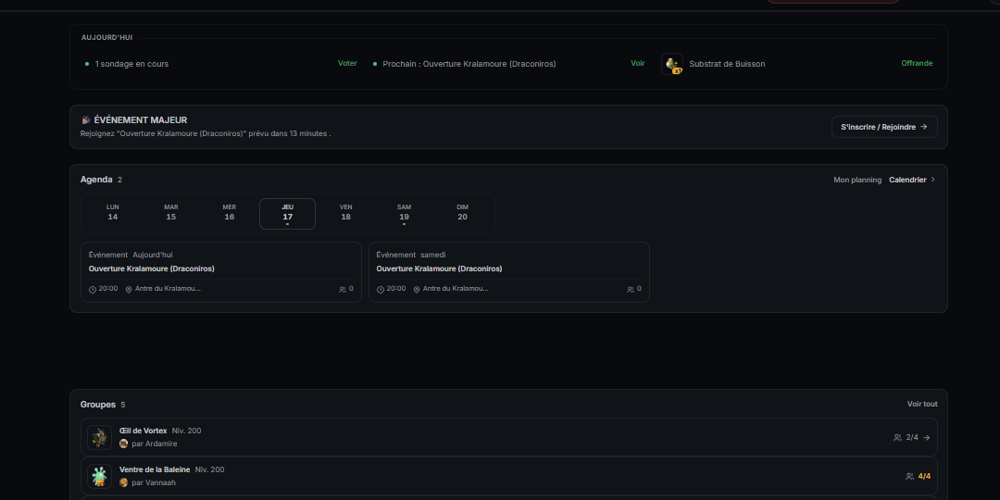
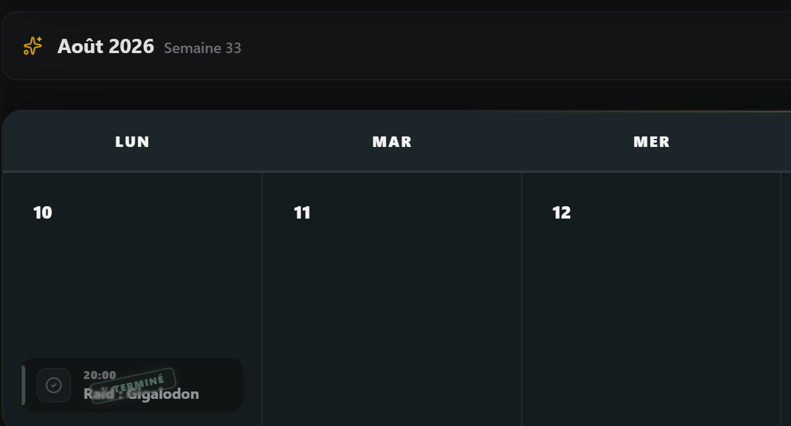
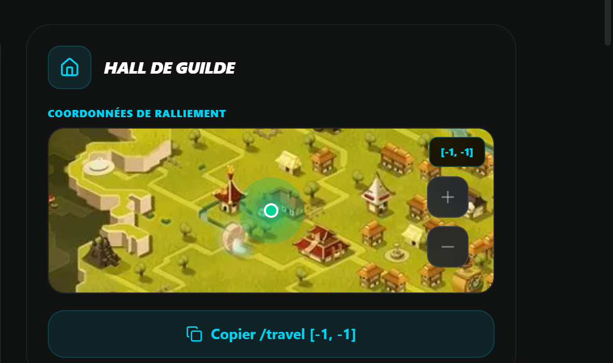
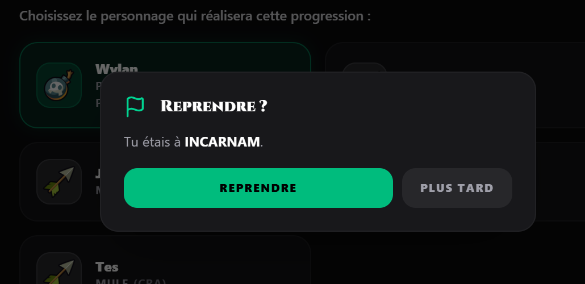

# 🛡️ SigilOS

### La plateforme qui fait vivre une guilde Dofus.

Un **tableau de bord web** + un **bot Discord**, réunis pour arrêter de gérer la guilde
entre 12 salons Discord, 3 tableurs et la mémoire de deux officiers.
Sorties, missions, guides, succès, échanges : **une seule vérité, au même endroit.**

[**↗ sigilos.fr**](https://sigilos.fr) · [**↗ bêta**](https://beta.sigilos.fr)

Dépôt public (vitrine technique) — © SigilOS, tous droits réservés, aucune licence accordée.

---

## ✨ Ce que fait SigilOS

| | |
|---|---|
| 🗓️ **Sorties & raids** | Calendrier d'événements de guilde (donjons, raids, chasses), inscriptions, rappels Discord automatiques, suivi de qui vient. |
| 🎯 **Missions de guilde** | Paliers d'XP de guilde, objectifs à valider, historique : on voit ce que la guilde accomplit réellement. |
| 🗺️ **Guides qui suivent la progression** | Guides de quêtes interactifs (dont le *Rush Sylvestre*) : étape courante, coordonnées copiables, progression conservée d'une session à l'autre, par personnage. |
| 🔎 **Recherche de donjons** | Trouver un groupe en quelques secondes : niveau, succès visés, créneau, commentaires. |
| 🤝 **Marché & services entre membres** | Échanges, offres, réservations, preuves, signalements — et les outils du jeu (armurerie, recherche d'objets, statistiques). |
| 🏆 **Succès, avis de recherche & boss** | Suivi des succès, chasse aux avis de recherche, fiches de boss et cartes de combat. |
| 🛡️ **Vie de guilde au propre** | Membres, rôles, journal des arrivées/départs/bannissements, candidatures, tickets — sans bruit. |
| 🌍 **FR / EN** | Interface et guides bilingues. |

> **Pour qui ?** Les guildes Dofus qui veulent un outil sérieux : officiers qui organisent,
> membres qui veulent juste savoir *quoi faire ensuite*.

---

## 🖼️ Aperçu

| Tableau de bord | Calendrier des sorties |
|---|---|
|  |  |

| Missions de guilde | Guide Sylvestre |
|---|---|
|  |  |

---

## 🚦 État du projet

**Bêta fermée, en développement actif.** L'accès se fait sur demande via le site ;
les nouvelles guildes sont accompagnées lors de la configuration de leurs modules.

---

## 🔐 Sécurité

Une vulnérabilité ? **Ne pas ouvrir d'issue publique** : passe par le
[**signalement privé GitHub**](https://github.com/Klyx04/SigilOS/security/advisories/new)
(canal officiel, activé sur ce dépôt) — politique complète et état réel des mesures : [`docs/SECURITY.md`](docs/SECURITY.md).

## 📄 Licence

© 2026 SigilOS — **Tous droits réservés.** Le dépôt est public (vitrine technique), mais
**aucune licence** d'utilisation, de copie ou de redistribution n'est accordée sans
autorisation écrite. Les données, noms et visuels de jeu Dofus appartiennent à Ankama.

---

🐛 Un bug, une idée, une question ? Passe par le site ou par le Discord de la guilde.

