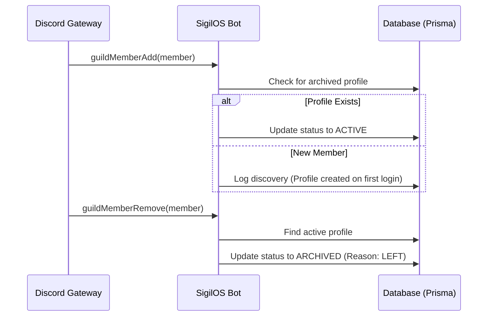

# Proposal: Automated Membership Synchronization

To achieve real-time synchronization between Discord membership and SigilOS profiles, we should implement a dedicated event listener within the Discord bot.

## Architecture



## Implementation Details

### 1. Gateway Intents
The bot must be initialized with the `GuildMembers` intent:
```typescript
const client = new Client({
    intents: [
        GatewayIntentBits.Guilds,
        GatewayIntentBits.GuildMembers, // <--- Required
    ]
});
```

### 2. Event Handlers

**Member Added:**
```typescript
client.on('guildMemberAdd', async (member) => {
    // 1. Find the profile
    const profile = await db.userProfile.findFirst({
        where: {
            user: { accounts: { some: { providerAccountId: member.id } } },
            guild: { discordGuildId: member.guild.id }
        }
    });

    // 2. Reactivate if archived
    if (profile && profile.status === 'ARCHIVED') {
        await db.userProfile.update({
            where: { id: profile.id },
            data: { status: 'ACTIVE', archivedAt: null, archiveReason: null }
        });
        console.log(`[Bot] Reactivated returning member: ${member.user.tag}`);
    }
});
```

**Member Removed:**
```typescript
client.on('guildMemberRemove', async (member) => {
    // 1. Find and archive
    const profile = await db.userProfile.findFirst({
        where: {
            user: { accounts: { some: { providerAccountId: member.id } } },
            guild: { discordGuildId: member.guild.id }
        }
    });

    if (profile && profile.status === 'ACTIVE') {
        await db.userProfile.update({
            where: { id: profile.id },
            data: { status: 'ARCHIVED', archivedAt: new Date(), archiveReason: 'LEFT' }
        });
        console.log(`[Bot] Archived member who left: ${member.user.tag}`);
    }
});
```

## Benefits
- **Zero Latency**: Profiles are archived/reactivated instantly.
- **Accuracy**: Eliminates discrepancies between manual sync intervals.
- **Resource Efficient**: Only processes single members instead of scanning the entire guild.
