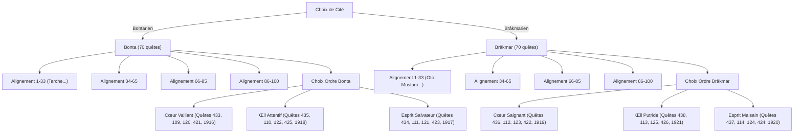

# Cartographie Comparative & Trame Complète : Dofusyelle vs Tougli RSA

> **Objectif :** Fusionner la route de rush hyper-optimisée de **Dofusyelle** (57 étapes chronologiques de mutualisation de donjons et allers-retours) avec l'exhaustivité modulaire de **Tougli RSA** (arbre d'alignement Bonta/Brâkmar, 6 ordres, fiches de monstres et combats solo) pour créer la **Trame Ultime du Rush Sylvestre** dans SigilOS.

---

## 1. Vue d'ensemble & Chiffres Clés

| Indicateur | Dofusyelle (Laniyelle & Marcellusito) | Tougli RSA (Barbofus) | Trame Fusionnée SigilOS |
|---|:---:|:---:|:---:|
| **Format** | 57 étapes chronologiques de Rush | 35 chapitres thématiques linéaires | **57 jalons chronologiques avec sous-branches** |
| **Nombre total de quêtes** | 346 quêtes uniques référencées | 529 quêtes uniques référencées | **346 quêtes rush (socle commun) + 140 alternatives** |
| **Quêtes communes** | 341 quêtes (98.5% du guide Yelle) | 341 quêtes | **100% du parcours optimal** |
| **Alignement Cité** | 🔴 **Bonta imposé** (+ protecteur Djaul) | 🟢 **Arborescence Bonta OU Brâkmar** | 🟢 **Sélecteur dynamique Bonta / Brâkmar** |
| **Ordres de Cité** | Ordre non paramétrable | 🟢 **6 Ordres complets** (rangs 1 à 5) | 🟢 **Sélecteur dynamique d'Ordre (1 à 6)** |
| **Mutualisation Donjons** | 🟢 **40 saves de donjons calculées** | 🔴 Aucune mutualisation (donjons en fin de Dofus) | 🟢 **Saves & Arrêts stratégiques intégrés** |
| **Préparation en amont** | 🟢 **21 points clés** (métiers, dalles Henual, items) | 🔴 Aucune checklist pré-rush | 🟢 **Checklist Pré-Rush intégrée** |
| **Ressources globales** | 531 ressources avec multiplicateur perso | 376 items de craft/drop | **Ressources agrégées par étape & personnage** |

---

## 2. Concordances et Divergences Fondamentales

### A. Ce qui concorde parfaitement (Le socle commun)
Les 341 quêtes communes couvrent l'intégralité des prérequis obligatoires pour le Dofus Sylvestre :
1. **Les Dofus Primordiaux :**
   - Émeraude (Bandits de Cania, Merlan, etc.)
   - Pourpre (Tablettes de Totankama, Minotoror, etc.)
   - Turquoise (Donjons scores et boss)
   - Ocre (Éternelle Moisson / Kralamoure géant)
   - Ivoire (Alignement 100, quêtes d'ordres, Dardondakal)
   - Ébène (Songes Infinis, Dazak, Crocobur)
2. **Les séries secondaires indispensables :**
   - Dofus des Veilleurs (série dimensionnelle)
   - Frigost 1, 2, 3 (Monologue du vaccin, Âme de Glace, etc.)
   - Pandala : Domakuro, Dorigami, Dofus Tacheté
   - Ocre d'Ambre & Quêtes de Silvosse
   - Eliocalypse : Résonance & L'avenir du futur
   - Les 4 Cavaliers de l'Eliocalypse (Servitude, Misère, Corruption, Guerre)
   - Archipel de Valonia (Lances de Wukin/Wukang, Ilyzaelle)
   - Ravageurs & Ravagés
   - Dofus du Cauchemar & Dom de Pin

---

### B. Ce qui diverge (Les optimisations exclusives Dofusyelle)

Dofusyelle ne suit **PAS** l'ordre des Dofus un par un. Il les découpe pour mutualiser les donjons et les zones géographiques :

1. **Les Arrêts Stratégiques ("Stops de Donjon") :**
   - **Stop Damadrya :** Dofusyelle stoppe la quête *Ocre d'Ambre* (Étape 10) devant Damadrya pour n'entrer dans le donjon qu'à l'Étape 13 avec les quêtes du *Domakuro* (*Le saule du promeneur*).
   - **Stop Kanigroula :** Arrêt à l'Étape 15 (*Dofus Turquoise*), repris à l'Étape 21 (*Alignement Bonta 65-70*) et l'Étape 22 (*La voyageuse imprudente*). **Un seul donjon Kanigroula pour 3 séries de quêtes !**
   - **Stop Korriandre :** Arrêt à l'Étape 23 (*Turquoise*), mutualisé à l'Étape 24 (*Bonta 70-85*) et l'Étape 25 (*Silvosse*).
   - **Stop Chêne Mou :** Quêtes de Silvosse stoppées au Chêne Mou (Étape 11) et groupées plus tard.
   - **Stop Koumiho :** Groupage Domakuro + Ocre d'Ambre (Étape 16-17).
   - **Stop Donjons Fri 3 / Necronyx :** Groupage des drops de sacrifices (*L'arme fatale*) directement dans les salles de Missiz Frizz, Tal Kasha, Nileza et Dazak (Étape 33).

2. **Les "Skips" & Raccourcis de Rush :**
   - **Dofus Argenté esquivé :** Dofusyelle évite l'Argenté intégral (*"Esquiver l'argenté comme des GOAT"*), en ne faisant que la *Grande Bibliothèque* et les quêtes strictes d'accès.
   - **Lumière sur l'Ombre tronqué :** Fait uniquement jusqu'à l'accès de la grotte de glace, pas en entier.
   - **Dépôt de ravitaillement tronqué :** Arrêté dès que *Chaud du slip* est validé pour enchaîner sur *Mission Solution*.
   - **Contournement Donjon Meno :** À l'Étape 52 (*Dofus Ivoire - Une voie de cristal*), **ne pas refaire le donjon Meno** mais simplement parler au Pichon devant le donjon !
   - **Éviter le piège de Rathrosk :** À l'Étape 54 (*Six sur Six*), **NE PAS LANCER "Le Silence est d'Aure"** en parlant à Rathrosk.
   - **Piège de dialogue des Sages Wabbits :** À l'Étape 37 (*Dofus Tacheté*), attention au choix de dialogue sous peine de **30 minutes de blocage forcé**.

3. **L'alerte critique "Pixel Perpétuel" :**
   - Dofusyelle prévient dès l'Étape 1 : lancer immédiatement la quête *"Chaque chose en son temps"* dès qu'une anomalie temporelle ouvre sur le serveur pour drop le *Pixel Perpétuel*, sous peine de se retrouver **complètement bloqué à l'Étape 58** (Cauchemar). Tougli ne mentionne pas ce blocage temps-réel.

---

### C. Ce que Tougli apporte de supérieur (L'arborescence complète)

1. **La branche Brâkmar complète :**
   - Dofusyelle ne détaille que la route Bonta. Tougli fournit le mapping 1-to-1 de toutes les quêtes d'alignement Brâkmarien pour chaque palier (1-20, 21-40, 41-65, 66-85, 86-100).
2. **L'arbre des 6 Ordres (Rangs 1 à 5) :**
   - **Bonta :** Cœur Vaillant (CV), Œil Attentif (OA), Esprit Salvateur (ES).
   - **Brâkmar :** Cœur Saignant (CS), Œil Putride (OP), Esprit Malsain (EM).
   - Chaque ordre a ses propres PNJ, combats spécifiques et donjons requis (ex: Ougah pour CV).
3. **Fiches techniques détaillées par quête :**
   - Monstres avec PV, liens Dofensive, combats tactiques solo identifiés (ex: combat Tarche, combat Crocobur, combat Maimane).

---

## 3. Matrice de Concordance : 57 Étapes Dofusyelle ↔ Chapitres Tougli

| Étape Yelle | Titre Étape (Dofusyelle) | Catégorie | Chapitre Tougli Correspondant | Donjons & Mutualisations Clés |
|:---:|---|---|---|---|
| **1** | Avant de commencer | Départ | *Préparation / Notes* | Alerte Pixel Perpétuel + Moisson / Krala |
| **2** | Quêtes Incarnam, Astrub, Pandala | Départ | [1] Incarnam, [2] Astrub, [3] Prérequis | Kankreblath, Aventure Miniature |
| **3** | Alignement 1 (Tarche) | Alignement | [4] Veilleurs, [5] Alignement 1/4 | Quête de classe + Entraînement Tarche |
| **4** | Frigost 1 (Vaccin & Lac) | Frigost | [19] Frigost, [4] Veilleurs | Mansot Royal (opti Chasseurs + Pêche) / 20h impératif |
| **5** | Quêtes Sidimote | Sidimote | [4] Veilleurs | **Stop devant le Meulou** |
| **6** | Frigost 2 (Dépôt & Solution) | Frigost | [19] Frigost | Mansot Royal + Ben le Ripate |
| **7** | Dofus des Veilleurs 1 | Veilleurs | [4] Dofus des Veilleurs | Donjons dimensions & zones |
| **8** | Dofus Pourpre 1 (Labyrinthe) | Pourpre | [7] Dofus Pourpre | Minotoror, Dragon Cochon |
| **9** | Dofus Émeraude | Émeraude | [6] Dofus Émeraude | Bandits de Cania (cartes) + captures boss |
| **10** | Ocre d'Ambre 1 | Ocre Ambre | [16] Ocre d'Ambre | **Stop devant Damadrya** |
| **11** | Quêtes de Silvosse 1 | Silvosse | [21] Silvosse | **Stop devant le Chêne Mou** |
| **12** | Alignement 33 à 65 | Alignement | [5] Alignement 1/4 & [8] Alignement 2/4 | Bonta 33-65 (ou Brâkmar 33-65) |
| **13** | Pandala - Domakuro 1 | Pandala | [20] Pandala | **Donjon Damadrya** (valide Ambre 1 + Domakuro) |
| **14** | Dofus Pourpre 2 (Fin) | Pourpre | [7] Dofus Pourpre | Fin Dofus Pourpre |
| **15** | Dofus Turquoise 1 | Turquoise | [9] Dofus Turquoise | **Stop devant Kanigroula** |
| **16** | Ocre d'Ambre 2 | Ocre Ambre | [16] Ocre d'Ambre | **Stop devant Koumiho** |
| **17** | Pandala - Domakuro 2 | Pandala | [20] Pandala | **Donjon Koumiho** (valide Domakuro + Ambre 2) |
| **18** | Pandala - Dorigami | Pandala | [20] Pandala | Donjons Pandala 2 + obtention Dorigami |
| **19** | Dofus Tacheté 1 & Moine | Tacheté | [20] Pandala | **Stop devant les donjons Wabbit/Pandala** |
| **20** | Ocre d'Ambre 3 (Fin) | Ocre Ambre | [16] Ocre d'Ambre | Fin Dofus Ocre d'Ambre |
| **21** | Alignement 65 à 70 | Alignement | [8] Alignement 2/4 | Alhyène en extérieur + **Stop Kanigroula** |
| **22** | La voyageuse imprudente | Annexes | [8] Alignement 2/4 | Chachyène de vie + **Stop Kanigroula** |
| **23** | Dofus Turquoise 2 | Turquoise | [9] Dofus Turquoise | **Donjon Kanigroula fait !** + **Stop Korriandre** |
| **24** | Alignement 70 à 85 + Ordre 4 | Alignement | [11] Alignement 3/4, [14] Ordres | **Stop Korriandre** (Ali) + **Stop Ougah** (Ordre) |
| **25** | Quêtes de Silvosse 2 | Silvosse | [21] Silvosse | **Stop Korriandre** |
| **26** | Dofus Turquoise 3 (Fin) | Turquoise | [9] Dofus Turquoise | **Donjon Korriandre fait !** + Fin Turquoise |
| **27** | Frigost - Mission Solution | Frigost | [19] Frigost | Blérice de Mission Solution |
| **28** | Eliocalypse : Résonance | Eliocalypse | [23] Eliocalypse : Résonance | Résonance + L'avenir du futur |
| **29** | Quatre sur six | Annexes | [17] Quatre sur six | 10 quêtes de la série |
| **30** | Fratrie des oubliés | Annexes | [17] Quatre sur six | **Stop au Fléau de Burin** (Volkaragnar) |
| **31** | Zone Dazak 1 | Dazak | [12] Dofus Ébène | Stop drop zone Missiz Frizz |
| **32** | Frigost : L'Âme de glace | Frigost | [19] Frigost | Poursuite jusqu'au Nileza |
| **33** | Quêtes Necronyx | Necronyx | [12] Dofus Ébène | **Stop sacrifices** (mutualisés Missiz, Tal Kasha, Dazak) |
| **34** | Alignement 85 à 99 | Alignement | [13] Alignement 4/4 | Bonta 85-99 (ou Brâkmar 85-99) |
| **35** | Zone Dazak 2 (Fin) | Dazak | [12] Dofus Ébène | Fin série Dazak |
| **36** | Valonia 1 | Valonia | [26] Valonia | **Stop drop lances Wukin/Wukang** |
| **37** | Dofus Tacheté (Fin) | Tacheté | [20] Pandala | ⚠️ Attention dialogues Sages (sinon 30m blocage) |
| **38** | Valonia 2 | Valonia | [26] Valonia | **Stop Ilyzaelle** |
| **39** | Les 4 Cavaliers | Cavaliers | [27] à [33] Cavaliers (Misère, Corruption, Servitude, Guerre) | 17 quêtes complètes des 4 cavaliers |
| **40** | Valonia 3 (Fin) | Valonia | [26] Valonia | Fin série Valonia |
| **41** | Le poids de son regard | Ébène | [12] Dofus Ébène | **Stop aux Songes Infinis** |
| **42** | Dofus Ébène 1 | Ébène | [12] Dofus Ébène | Songes terminés |
| **43** | Grobelin & Silvosse | Silvosse | [21] Silvosse | Gobstination d'un Grobelin |
| **44** | Quêtes Ravageurs | Ravageurs | [25] Ravageurs | Prérequis Dom de Pin |
| **45** | Dofus Cauchemar 1 | Cauchemar | [24] Ravagés | Jusqu'aux totems de Maimane |
| **46** | Alignement 100 + Ordre 5 | Alignement | [13] Alignement 4/4, [14] Ordres | Passage 100 + Ordre 5 (prérequis Ivoire) |
| **47** | Prérequis Dofus Ivoire | Ivoire | [15] Dofus Ivoire | Nimotopia + Sufokia |
| **48** | Fin Arme Fatale & Ébène | Ébène | [12] Dofus Ébène | Fin drop sacrifices + Crocobur |
| **49** | Dofus Cauchemar (Fin) | Cauchemar | [24] Ravagés | Obtention du Cauchemar |
| **50** | Silvosse 3 | Silvosse | [21] Silvosse | Qui nous protège des protecteurs |
| **51** | Dofus Ébène (Fin) | Ébène | [12] Dofus Ébène | Obtention du Dofus Ébène |
| **52** | Dofus Ivoire (Fin) | Ivoire | [15] Dofus Ivoire | ⚠️ *Une voie de cristal* : parler au Pichon extérieur ! |
| **53** | Frigost : Chaud et Froid | Frigost | [19] Frigost | Fin de l'Âme de Glace |
| **54** | Six sur Six | Six sur Six | [34] Six sur Six | ⚠️ **NE PAS LANCER "Le Silence est d'Aure"** |
| **55** | Silvosse (Final) | Silvosse | [21] Silvosse | Le secret des Dofus Prologue |
| **56** | Dofus Dom de Pin | Dom de Pin | [34] Six sur Six | Obtention Dom de Pin |
| **57** | Dofus Sylvestre (Apogée) | Sylvestre | [35] Dofus Sylvestre | Récupération du Dofus Sylvestre ! 🏆 |

---

## 4. L'Arbre des Alignements & Ordres (Issu de Tougli)

Dans SigilOS, la trame permet à l'utilisateur de basculer dynamiquement son Alignement (**Bonta** ou **Brâkmar**) et son **Ordre** (1 à 6) :

---

## 5. La Checklist Pré-Rush (Les 21 Piliers Dofusyelle)

1. **Métiers :** Monter les métiers de récolte de base (Pêcheur, Paysan, Mineur, Alchimiste).
2. **Mariage :** Se marier en jeu pour bénéficier du bouton TP immédiat vers son binôme de rush.
3. **Stuffs & Consommables :** Prévoir stuff combat + pods + prospection/initiative.
4. **Parchottage & Sorts :** 100 stats de base + sorts communs débloqués (Flammèche, Libération, Cawotte).
5. **Portails Dimensionnels :** Pré-chasser ou localiser les portails Enutrosor, Srambad, Xélorium.
6. **Consommables de Rush :** Dragobons, Shigekax, potions de cité, potions de rappel, soins.
7. **Tablettes de Totankama :** Achetées ou pré-drop pour le Pourpre.
8. **Cartes des Bandits de Cania :** Les 3 cartes pré-assemblées ou achetées (Émeraude).
9. **Captures de Boss Émeraude :** Âmes de boss prêtes pour l'étape Émeraude.
10. **Achat des 531 Ressources :** Achat groupé en HDV grâce au tableau de ressources.
11. **Clefs de donjons :** Achat x2 pour tous les donjons de la route (et x4 pour les donjons à répétition).
12. **Pierres d'âmes pour Ocre :** Boss et archimonstres pré-capturés pour valider instantanément Krala.
13. **Brandades de Morue :** Consommable pour ajuster l'initiative sur les combats tactiques.
14. **Merkator :** Sauvegarder ou préparer l'accès Sufokia profonde.
15. **Dalles Henual :** Ouvrir la porte d'Henual à l'avance pour éviter de bloquer 4 joueurs sur les dalles.
16. **Monture / Familier :** DD équipée pour l'autotravel sans fatigue d'énergie.
17. **Saves de Donjons (40) :** Prendre les checkpoints avant les boss pour les donjons non-séquentiels.
18. **Barres de raccourcis :** Bind des potions, Zaaps favoris et sets d'équipement.

---

## 6. Prochaines Étapes d'Implémentation dans SigilOS

1. **Génération du jeu de données JSON unifié** : Combiner `steps`, `quetes`, `coords`, `dungeons`, `tips` et branches dans `prisma/seed-data/dofus-quests/rush-sylvestre-unified.json`.
2. **Injecter dans la base via le module God** (`src/app/god/rush-sylvestre/`).
3. **Mise à jour de l'Overlay** : Intégrer les filtres d'Alignement / Ordre et les indicateurs visuels de Stop Boss et d'horaires.
